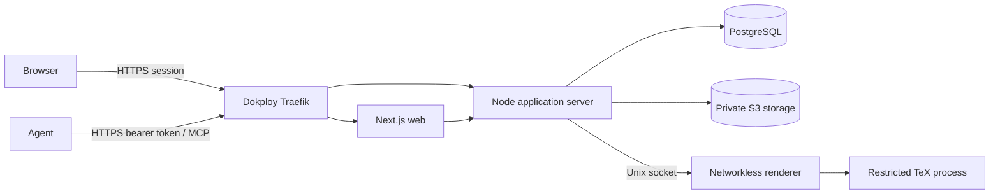

# HyperGenDoc MVP architecture

## Scope

HyperGenDoc is a multi-tenant service for agencies that manage branded PDF documents for client companies. Humans configure workspaces, companies, styles, memberships, and agent credentials in a web dashboard. Agents use standard MCP tools to discover authorized companies/styles and create or revise documents.

The MVP deliberately supports proposals, contracts-as-artifacts, and internal documents. It is not a general LaTeX host, accounting system, legal review product, or browser document editor.

## Runtime topology



Dokploy's host-level Traefik is the only public HTTP/HTTPS entry point; the application Compose stack publishes no host ports. PostgreSQL, object storage, server internals, and renderer IPC remain private. The renderer has no network namespace access, application secrets, database credentials, object-store credentials, host mounts, or Docker socket.

## Repository boundaries

- `apps/web`: Next.js dashboard and browser-facing API client.
- `apps/server`: HTTP APIs, Better Auth handler, domain services, MCP Streamable HTTP adapter, authorization, orchestration, and audit logging.
- `apps/renderer`: Unix-socket daemon and restricted TeX process.
- `packages/contracts`: versioned Zod schemas shared across transports.
- `packages/db`: Drizzle PostgreSQL schema, migrations, and database client.
- `packages/config`: validated environment and shared limits.
- `packages/latex`: curated body parser, style wrapper, normalization, and safe diagnostics.
- `packages/test-support`: fixtures and isolated dependency helpers.

Transport adapters never query tenant data directly. Browser HTTP and MCP call the same authoritative domain services with an actor context.

## Core entity model

```mermaid
erDiagram
  USER ||--o{ MEMBERSHIP : has
  WORKSPACE ||--o{ MEMBERSHIP : contains
  WORKSPACE ||--o{ COMPANY : owns
  COMPANY ||--o{ STYLE : owns
  STYLE ||--o{ STYLE_VERSION : versions
  COMPANY ||--o{ DOCUMENT : owns
  DOCUMENT ||--o{ DOCUMENT_VERSION : versions
  STYLE_VERSION ||--o{ DOCUMENT_VERSION : renders
  WORKSPACE ||--o{ MCP_CREDENTIAL : issues
  MCP_CREDENTIAL ||--o{ MCP_COMPANY_SCOPE : limits
  DOCUMENT_VERSION ||--|| RENDER_RECORD : produces
  WORKSPACE ||--o{ AUDIT_EVENT : records
```

All tenant-owned rows carry or resolve to a workspace. Repositories require a trusted workspace identifier from session or credential context; they do not accept an unverified workspace ID from request bodies.

## Immutable version lifecycle

### Styles

1. A logical style belongs to one company.
2. Creation writes style version 1 and marks it active in one transaction.
3. Editing creates a new immutable version and may atomically activate it.
4. Existing document versions remain pinned to their recorded style version.
5. Deactivating a style prevents new document selection but does not break history.

### Documents

1. Creation writes a logical document and pending version 1.
2. The server normalizes the allowed body, resolves the exact active style version, and sends a render job.
3. Success stores private source/PDF artifacts and hashes, marks the immutable version ready, and advances the document's current-version pointer transactionally.
4. Failure records safe diagnostics without advancing the current pointer.
5. A revision allocates a new monotonic version. It inherits the previous exact style version unless the authorized caller explicitly selects another active version.
6. Previous versions are never overwritten. An explicit delete follows the data policy and audit trail.

## Authentication and authorization

- Better Auth provides verified email/password accounts, reset flow, and secure sessions backed by PostgreSQL.
- Initial roles are `owner` and `member` per workspace.
- MCP tokens are random opaque bearer credentials. Only a token hash and non-secret lookup prefix are stored; plaintext is shown once.
- MCP permissions combine action scope and company allow-list. Revocation is checked on every request.
- Human and agent actions emit audit records with actor, workspace, target, request ID, timestamp, and non-sensitive outcome metadata.

See `docs/security/permission-matrix.md` for binding policy.

## Style and document contract

A style version contains structured, validated brand-and-layout data: logo object reference, body/heading font choices from an installed allow-list, body/heading sizes, italic behavior, color palette, page size, margins, headers, and footers. It never contains user-authored TeX.

An agent submits only the documented content subset. The server owns the document class, packages, preamble, brand macros, and layout. The resolved source, normalized input hash, exact style version, renderer image/version, output hash, actor, and timestamp are recorded for reproducibility.

## Initial implementation choices

- TypeScript with strict compiler settings and pnpm workspaces.
- Next.js dashboard, Fastify application server, official MCP TypeScript SDK, Zod contracts.
- Better Auth with Drizzle/PostgreSQL.
- PostgreSQL metadata and private MinIO-compatible development storage.
- Pinned TeX distribution in a dedicated renderer image.
- Standalone Docker Compose deployed by Dokploy, with Dokploy Traefik terminating TLS and routing paths on one VPS.

Package APIs must be checked against official current documentation before implementation. Lockfiles and container digests make builds reproducible.

## Deferred work

Agent style edits, client portals, financial documents, collaborative editing, arbitrary templates/packages, billing, Kubernetes, and generalized workflow engines are excluded from this architecture.
