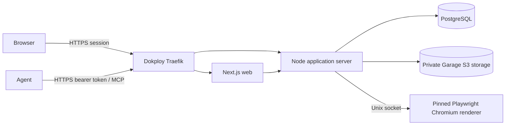

# HyperGenDoc MVP architecture

## Scope

HyperGenDoc is a multi-tenant service for agencies that manage branded PDF documents for client companies. Humans configure workspaces, companies, styles, memberships, and agent credentials in a web dashboard. Agents use standard MCP tools to discover authorized companies/styles and create or revise documents.

The MVP deliberately supports proposals, contract-like artifacts, and internal documents. It is not a general document-runtime host, accounting system, legal review product, or browser document editor.

## Runtime topology



Dokploy's host-level Traefik is the only public HTTP/HTTPS entry point; the application Compose stack publishes no host ports. PostgreSQL, object storage, server internals, and renderer IPC remain private. The renderer has no network, application secrets, database credentials, object-store credentials, host mounts, or Docker socket.

The renderer is a version-matched pinned Playwright Chromium process reached over a Unix socket. It runs one job at a time and accepts at most one additional queued job. Each job uses a fresh browser and context that are closed on success, failure, or timeout. Browser networking is disabled and every browser request is aborted. The renderer runs non-root with a read-only root filesystem, `no-new-privileges`, all capabilities dropped except the narrowly required `SYS_CHROOT`, and seccomp sandbox containment.

## Repository boundaries

- `apps/web`: Next.js dashboard and browser-facing API client.
- `apps/server`: HTTP APIs, Better Auth handler, domain services, MCP Streamable HTTP adapter, authorization, orchestration, and audit logging.
- `apps/renderer`: Unix-socket daemon and pinned browser renderer.
- `packages/contracts`: versioned Zod schemas shared across transports.
- `packages/db`: Drizzle PostgreSQL schema, migrations, and database client.
- `packages/config`: validated environment and shared limits.
- `packages/test-support`: fixtures and isolated dependency helpers.

Transport adapters never query tenant data directly. Browser HTTP and MCP call the same authoritative domain services with an actor context.

## Core entity model

```mermaid
erDiagram
  USER ||--o{ MEMBERSHIP : has
  WORKSPACE ||--o{ MEMBERSHIP : contains
  WORKSPACE ||--o{ COMPANY : owns
  COMPANY ||--o{ STYLE : owns
  STYLE ||--o{ STYLE_VERSION : versions
  COMPANY ||--o{ DOCUMENT : owns
  DOCUMENT ||--o{ DOCUMENT_VERSION : versions
  STYLE_VERSION ||--o{ DOCUMENT_VERSION : renders
  WORKSPACE ||--o{ MCP_CREDENTIAL : issues
  MCP_CREDENTIAL ||--o{ MCP_COMPANY_SCOPE : limits
  DOCUMENT_VERSION ||--|| RENDER_RECORD : produces
  WORKSPACE ||--o{ AUDIT_EVENT : records
```

All tenant-owned rows carry or resolve to a workspace. Repositories require a trusted workspace identifier from session or credential context; they do not accept an unverified workspace ID from request bodies.

## Immutable version lifecycle

### Styles

1. A logical style belongs to one company.
2. Creation writes style version 1 and marks it active in one transaction.
3. Editing creates a new immutable version and may atomically activate it.
4. Existing document versions remain pinned to their recorded style version.
5. Deactivating a style prevents new document selection but does not break history.

### Documents

1. Creation writes a logical document and pending version 1 with an explicit `format` of `"markdown"` or `"html"` and the original exact body.
2. The server validates the input, resolves the exact active style version, creates deterministic fully styled HTML, and sends a render job.
3. Success stores private render evidence and a PDF with hashes, marks the immutable version ready, and advances the document's current-version pointer transactionally.
4. Failure records safe diagnostics without advancing the current pointer.
5. A revision allocates a new monotonic version. It inherits the previous exact style version unless the authorized caller explicitly selects another active version.
6. Previous versions are never overwritten. An explicit delete follows the data policy and audit trail.

The original body and format are immutable database input. Their combined identity hash is recorded. The deterministic fully styled HTML is internal private render evidence (`text/html`), not the original input and not a client download. The input download route returns only the exact body as a `text/plain; charset=utf-8` attachment with a `.md` or `.html` filename. PDFs remain private authorized artifacts.

## Authentication and authorization

- Better Auth provides verified email/password accounts, reset flow, and secure sessions backed by PostgreSQL.
- Initial roles are `owner` and `member` per workspace.
- MCP tokens are random opaque bearer credentials. Only a token hash and non-secret lookup prefix are stored; plaintext is shown once.
- MCP permissions combine action scope and company allow-list. Revocation is checked on every request.
- Human and agent actions emit audit records with actor, workspace, target, request ID, timestamp, and non-sensitive outcome metadata.

See `docs/security/permission-matrix.md` for binding policy.

## Style and document contract

A style version contains structured, validated brand-and-layout data: logo object reference, body/heading font choices from an installed allow-list, body/heading sizes, italic behavior, color palette, page size, margins, headers, and footers. Structured server-owned fields generate all CSS, page layout, headers, footers, and page-number layout. A style never contains user-authored CSS.

Every document version requires an explicit `format`: `"markdown"` or `"html"`; format is never inferred. Markdown is plain text input. HTML is a fragment whose sanitized semantic content is rendered; the original exact HTML is still the immutable input. Empty sanitized input is rejected. The conservative sanitizer allows semantic headings, paragraphs, emphasis, lists, blockquotes, code/preformatted blocks, safe-protocol links, and tables. It removes scripts, styles, event handlers, forms, iframes, objects, embeds, SVG, images, arbitrary attributes/classes/IDs, inline CSS, protocol-relative/file/local/unsafe URLs, and external resources.

## Initial implementation choices

- TypeScript with strict settings and pnpm workspaces.
- Next.js dashboard, Fastify application server, official MCP TypeScript SDK, Zod contracts.
- Better Auth with Drizzle/PostgreSQL.
- Pinned version-matched Playwright Chromium renderer over a Unix socket, with one active and at most one queued job, no network, aborted browser requests, and per-job cleanup.
- Inputs are capped at 256 KiB; PDFs at 25 MiB; rendering at 30 seconds and 100 pages. The server verifies `%PDF-` and output hashes before accepting a PDF, and records only safe diagnostics.
- PostgreSQL metadata and private Garage S3-compatible storage at `http://object-store:3900` in region `garage`.
- Garage v2.3.0 is pinned to `docker.io/dxflrs/garage:v2.3.0@sha256:866bd13ed2038ba7e7190e840482bc27234c4afaf77be8cfa439ae088c1e4690`; its SQLite metadata and data directories use separate volumes with fsync enabled. The S3, RPC, and admin interfaces have no public ports; internal admin health is `GET http://object-store:3903/health`.
- This single-VPS deployment uses Garage automatic single-node/default-bucket setup and `replication_factor=1`. It has no redundancy, so encrypted off-VPS backups and tested restores are mandatory. Garage describes RF=1 as test-only; the future HA path is three nodes in three zones with RF=3.
- Garage provides the S3 operations used by HyperGenDoc; it does not provide S3 ACLs, bucket policies, or versioning, and HyperGenDoc does not depend on them.
- Standalone Docker Compose deployed by Dokploy, with Dokploy Traefik terminating TLS and routing paths on one VPS.

Package APIs must be checked against official current documentation before implementation. Lockfiles and container digests make builds reproducible.

## Deferred work

Agent style edits, client portals, financial documents, collaborative editing, arbitrary templates, billing, Kubernetes, and generalized workflow engines are excluded from this architecture.
